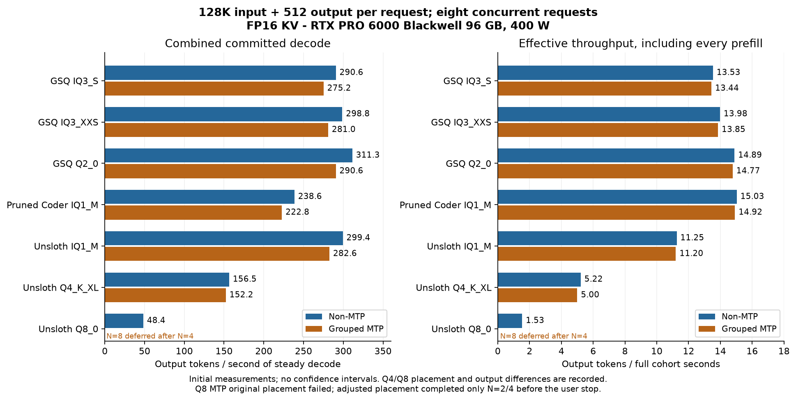

# 128K concurrency research snapshot

RTX PRO 6000 Blackwell Workstation **96 GB**, 400 W; Ryzen 9 7950X; 128 GB RAM.
**131,072 actual input + 512 forced output tokens per request, FP16 KV.**

Saved **58 complete cohorts / 388 requests / 198,656 committed output tokens**.
The adjusted Q8 MTP placement completed N=2 and N=4; the user ended testing before N=8.

Each table cell is aggregate committed **decode / effective tok/s**. Effective throughput includes all prefill.

| Model | Non-MTP N=8 | Grouped MTP N=8 |
|---|---:|---:|
| GSQ IQ3_S | 290.6 / 13.53 | 275.2 / 13.44 |
| GSQ IQ3_XXS | 298.8 / 13.98 | 281.0 / 13.85 |
| GSQ Q2_0 | 311.3 / 14.89 | 290.6 / 14.77 |
| Pruned Coder IQ1_M | 238.6 / 15.03 | 222.8 / 14.92 |
| Unsloth UD-IQ1_M | 299.4 / 11.25 | 282.6 / 11.20 |
| Unsloth UD-Q4_K_XL | 156.5 / 5.22 | 152.2 / 5.00 |
| Unsloth Q8_0 | 48.4 / 1.53 | unmeasured |

## Measured concurrency points

| Model | Policy | N=2 | N=4 | N=8 |
|---|---|---:|---:|---:|
| GSQ IQ3_S | Non-MTP | 187.8 / 13.28 | 248.3 / 13.44 | 290.6 / 13.53 |
| GSQ IQ3_S | Grouped MTP | 239.1 / 13.43 | 275.2 / 13.46 | 275.2 / 13.44 |
| GSQ IQ3_XXS | Non-MTP | 194.2 / 13.67 | 256.7 / 13.88 | 298.8 / 13.98 |
| GSQ IQ3_XXS | Grouped MTP | 242.8 / 13.80 | 281.5 / 13.87 | 281.0 / 13.85 |
| GSQ Q2_0 | Non-MTP | 203.0 / 14.60 | 266.0 / 14.79 | 311.3 / 14.89 |
| GSQ Q2_0 | Grouped MTP | 254.3 / 14.72 | 291.9 / 14.79 | 290.6 / 14.77 |
| Pruned Coder IQ1_M | Non-MTP | 166.5 / 14.68 | 211.9 / 14.93 | 238.6 / 15.03 |
| Pruned Coder IQ1_M | Grouped MTP | 201.2 / 14.85 | 222.3 / 14.93 | 222.8 / 14.92 |
| Unsloth UD-IQ1_M | Non-MTP | 194.3 / 11.06 | 258.0 / 11.19 | 299.4 / 11.25 |
| Unsloth UD-IQ1_M | Grouped MTP | 247.4 / 11.18 | 284.1 / 11.21 | 282.6 / 11.20 |
| Unsloth UD-Q4_K_XL | Non-MTP | 100.7 / 5.11 | 129.2 / 5.18 | 156.5 / 5.22 |
| Unsloth UD-Q4_K_XL | Grouped MTP | 131.5 / 4.97 | 152.0 / 5.00 | 152.2 / 5.00 |
| Unsloth Q8_0 | Non-MTP | 30.1 / 1.50 | 39.8 / 1.52 | 48.4 / 1.53 |
| Unsloth Q8_0 | Grouped MTP | 29.3 / 1.27 | 38.7 / 1.29 | unmeasured |

## Q8 memory boundary and adjustment

The original Q8 MTP configuration requested **52.5 GiB of GPU expert cache** with eight allocated sessions.
Two attempts completed their two-request cohorts, then exited during the four-request cohort with
**`ERR verify: batch instantiate: out of memory`**. Those attempts remain in the failure receipts.

The new placement requested **40 GiB of GPU expert cache**, leaving more VRAM for retained verification graphs.
Both placements use FP16 KV and a lazy-mapped PLE table; RAM contains the expert-cache complement.
The adjusted Q8 MTP placement completed N=2 and N=4; the user ended testing before N=8.

**Q8 non-MTP and adjusted MTP use different expert-cache sizes. Their table entries are practical configuration results;
the difference does not isolate the effect of MTP.** No eight-request adjusted-MTP result is inferred.

## Allocated slots change expert residency

| Model, non-MTP | Eight allocated slots, N=8 | Sixteen allocated slots, N=8 | Sixteen allocated slots, N=12 |
|---|---:|---:|---:|
| GSQ IQ3_S | 290.6 / 13.53 | 120.5 / 4.54 | 117.8 / 4.53 |
| GSQ IQ3_XXS | 298.8 / 13.98 | 164.5 / 6.52 | 164.3 / 6.53 |
| GSQ Q2_0 | 311.3 / 14.89 | 242.1 / 13.24 | 240.6 / 13.25 |
| Pruned Coder IQ1_M | 238.6 / 15.03 | 238.9 / 15.05 | 238.8 / 15.04 |
| Unsloth UD-IQ1_M | 299.4 / 11.25 | 169.0 / 6.89 | 168.4 / 6.89 |
| Unsloth UD-Q4_K_XL | 156.5 / 5.22 | 63.1 / 2.12 | 64.2 / 2.12 |

Q4 requested cache falls from **52.75 to 24 GiB** when reserving sixteen sessions.
At the same eight active requests, its output and completion rates fall substantially.
The sixteen-active-request point was skipped under the existing projected stream-speed threshold;
the precise decision is recorded in `skipped_counts`.

## Evidence and scope

- [results.json](results.json): completed points, exact lengths, placement, token hashes/differences, timing, memory/swap, source/binary/harness hashes and original-result hashes.
- [plot.py](plot.py): regenerates PNG and SVG. [overview.svg](overview.svg) is the vector figure.
- Source is **`cd9fccafd7b693734b7cd400f61d6bce2b7b74bc`**, unchanged from the [64K snapshot](../64k/README.md). No new inference-engine changes were made for this archive.
- Use the [existing harness and setup](../README.md) with input `131072`, output `512`, and the recorded arguments/environment for the relevant placement.
- These are initial exploratory observations. No confidence intervals, quality scores or matched unmodified-upstream speedup claim follows.
- Grouped decode does not advance the optimized solo asynchronous-adaptation rounds; these are different execution paths.
- Partially resident outputs differ across some concurrency counts. The causes remain unclassified.
- The user ended the remaining queue after the current N=4 point with a thirty-minute time budget. Remaining 2K-output knee workloads are deferred; prior results are preserved.

This supports the existing [PR #969](https://github.com/Niko1221/Strata/pull/969); no new PR is created for measurements.
Credit: [Niko1221/Strata](https://github.com/Niko1221/Strata), [rkcth #846](https://github.com/Niko1221/Strata/pull/846), [Hardin22 #904](https://github.com/Niko1221/Strata/pull/904), and [#947](https://github.com/Niko1221/Strata/pull/947).
