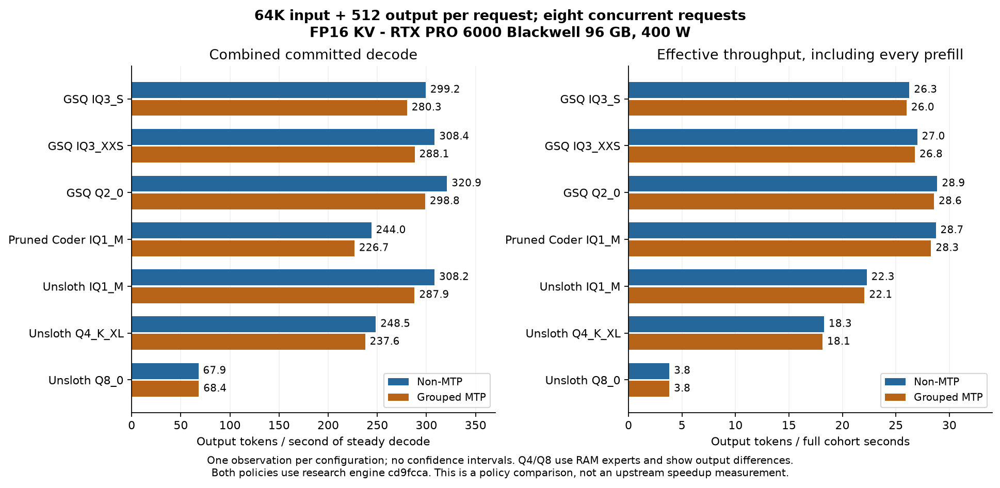

# Completed 64K concurrency screen

RTX PRO 6000 Blackwell Workstation **96 GB**, 400 W; Ryzen 9 7950X; 128 GB RAM.
**65,536 actual input + 512 forced output tokens per request, FP16 KV.**
Completed **60 cohorts / 412 requests / 210,944 committed output tokens** across seven models and both policies.

This is a research evidence snapshot for the existing [concurrency contribution, PR #969](https://github.com/Niko1221/Strata/pull/969).
Engine code is unchanged at `cd9fccafd7b693734b7cd400f61d6bce2b7b74bc`; this archive adds measurements and plots.
128K and distinct 2K-output workloads continue separately. No repeat-validation campaign is scheduled in this roofline branch.

## Equal eight-request comparison

Each cell is combined committed **decode / effective tok/s**. Effective includes every prefill.
Both policies allocate eight slots; MTP verifies at most four requests per physical window, non-MTP eight.

| Model | Non-MTP | Grouped MTP |
|---|---:|---:|
| GSQ IQ3_S | 299.2 / 26.26 | 280.3 / 26.00 |
| GSQ IQ3_XXS | 308.4 / 27.00 | 288.1 / 26.78 |
| GSQ Q2_0 | 320.9 / 28.88 | 298.8 / 28.57 |
| Pruned Coder IQ1_M | 244.0 / 28.74 | 226.7 / 28.30 |
| Unsloth UD-IQ1_M | 308.2 / 22.28 | 287.9 / 22.07 |
| Unsloth UD-Q4_K_XL | 248.5 / 18.28 | 237.6 / 18.14 |
| Unsloth Q8_0 | 67.9 / 3.82 | 68.4 / 3.82 |

## Concurrency changes the preferred policy

| Model | MTP decode N=2 / 4 / 8 | Non-MTP decode N=2 / 4 / 8 |
|---|---:|---:|
| GSQ IQ3_S | 243.0 / 280.0 / 280.3 | 191.6 / 255.4 / 299.2 |
| GSQ IQ3_XXS | 247.4 / 288.3 / 288.1 | 197.8 / 262.6 / 308.4 |
| GSQ Q2_0 | 257.7 / 299.1 / 298.8 | 207.0 / 273.4 / 320.9 |
| Pruned Coder IQ1_M | 206.3 / 229.6 / 226.7 | 169.2 / 216.2 / 244.0 |
| Unsloth UD-IQ1_M | 248.0 / 286.8 / 287.9 | 197.7 / 263.7 / 308.2 |
| Unsloth UD-Q4_K_XL | 196.9 / 238.5 / 237.6 | 149.9 / 202.6 / 248.5 |
| Unsloth Q8_0 | 55.3 / 66.3 / 68.4 | 45.6 / 54.2 / 67.9 |

- The first five models plateau near eight non-MTP requests with the current eight physical verifier rows. Logical waves at N=12/16 provide more slots, with similar aggregate throughput.
- Reserving sixteen slots changes expert residency. Q4 at the same N=8 falls from 248.5 decode / 18.28 effective to 150.5 / 9.52; the GPU expert cache shrinks from 67.25 to 51.50 GiB. This is a capacity/placement comparison.
- Q8 N=8 finishes in 1,072.1 seconds without MTP and 1,073.1 seconds with MTP. The 21-22% MTP decode gains seen at N=2/4 do not persist at N=8.
- Grouped decoding does not advance solo asynchronous adaptation rounds. These results do not measure the benefit of the optimized solo Q8 adaptation/duplex stack.

## What the baseline comparison establishes

A **separate single-request screen** used 32K input + 1K output, FP16 KV, all experts on GPU for six smaller quants.
Reference `18d3da4` is upstream `6f32ec0` plus the Q8 PLE reader, inactive for those six models; candidate is integration `70ed61f`.
See [single-request evidence](single-request-reference.json). These are not 64K concurrent stock-control measurements.

| Model | Baseline MTP T4 | Integration MTP T4 | Decode change |
|---|---:|---:|---:|
| GSQ IQ3_S | 253.6 | 259.8 | +2.4% |
| GSQ IQ3_XXS | 260.1 | 267.9 | +3.0% |
| GSQ Q2_0 | 279.1 | 287.2 | +2.9% |
| Pruned Coder IQ1_M | 213.6 | 218.8 | +2.4% |
| Unsloth UD-Q4_K_XL | 241.5 | 248.2 | +2.8% |
| Unsloth UD-IQ1_M | 268.3 | 276.5 | +3.1% |

All twelve baseline/integration pairs (MTP and non-MTP) matched output IDs and recorded work. Each arm is a single observation.
The earlier Q8 solo adaptation comparison is documented [separately](../../../docs/Q8_RESIDENT_ADAPTATION.md); it uses RAM experts and has different output/work trajectories in the full-stack comparison.

## Evidence, reproduction and limits

- [results.json](results.json) contains all twenty completed cases, sixty cohorts, exact input/output counts, token hashes, first differences, expert placement, process swap, binary/source/harness hashes and hashes of the original raw result files.
- [plot.py](plot.py) regenerates PNG and SVG from the JSON. [overview.svg](overview.svg) is the vector figure.
- Use the [existing harness and setup instructions](../README.md), set input to `65536`, output to `512`, and use the matching case arguments/placement in the receipt. Paths are placeholders; no weights or credentials are included.
- Most points have one observation. No confidence intervals, answer-quality score, hardware roofline, or complete unmodified-upstream 64K speedup claim follows from this screen.
- Partially resident Q4/Q8 outputs differ across some concurrency counts; causes are unclassified. Q8 process swap was observed. Measurements and differences are retained, not silently excluded.
- Allocated capacity, active request count, actual prompt length and GPU expert residency are separate variables.
- Eight physical verification rows remain the execution limit. Increasing logical slots does not widen the kernel.

## Next roofline experiments

Continue the first-pass context/output sweep, then investigate reducing reserved session/buffer memory, bringing the measured solo adaptation/transfer improvements into grouped decode, and wider physical verification kernels.
Each is a proposed experiment, not a result or an automatically running job.

Credit: [Niko1221/Strata](https://github.com/Niko1221/Strata), [rkcth #846](https://github.com/Niko1221/Strata/pull/846), [Hardin22 #904](https://github.com/Niko1221/Strata/pull/904), and the [all-resident batch fix #947](https://github.com/Niko1221/Strata/pull/947).
