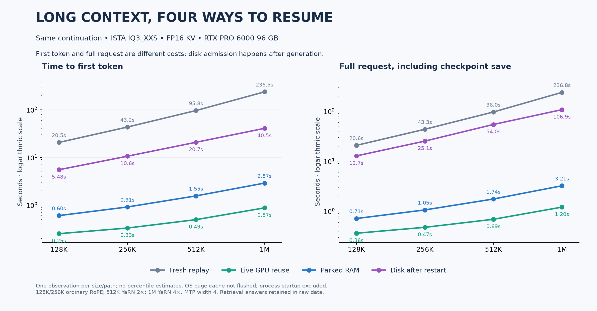
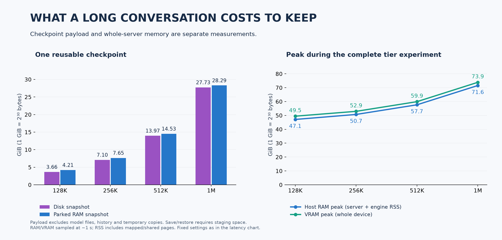

# Long-context checkpoint tiers

Integration candidate: upstream `fb58e0db` plus [#1667](https://github.com/Niko1221/Strata/pull/1667)'s checkpoint manager and
[#1692](https://github.com/Niko1221/Strata/pull/1692)'s existing-RoPE/YaRN report. No approximate RoPE-to-YaRN converter is included.

## Measured results

**At 1M, disk restore reduced first-token latency from 236.48 s to 40.53 s (5.8x).**
Including the updated checkpoint writeback, the full request took **106.89 s instead
of 236.84 s (2.2x faster, about 130 seconds saved)**. Live reuse took 0.87 s to
first token; parked-RAM restore took 2.87 s. These are measurements of one short
continuation per condition, not decode-throughput multipliers.



| Prefix | RoPE | Fresh TTFT | Live TTFT | RAM TTFT | Disk TTFT | Fresh complete | Disk complete |
|---|---|---:|---:|---:|---:|---:|---:|
| 128K | ordinary | 20.51 s | 0.25 s | 0.60 s | 5.48 s | 20.62 s | 12.69 s |
| 256K | ordinary | 43.17 s | 0.33 s | 0.91 s | 10.55 s | 43.32 s | 25.13 s |
| 512K | YaRN 2x | 95.78 s | 0.49 s | 1.55 s | 20.67 s | 95.98 s | 54.04 s |
| 1M | YaRN 4x | 236.48 s | 0.87 s | 2.87 s | 40.53 s | 236.84 s | 106.89 s |

**All 16 continuations returned the three codes in the correct order.** Each
size has identical continuation input hashes and execution identities across
tiers. Native logs confirm RAM restoration; catalog receipts confirm disk
restoration after a complete server restart. The follow-up contains 40 tokens
of new native computation after reusing `prefix_length - 7` tokens.



| Prefix | Disk snapshot | RAM snapshot | Peak server RAM | Peak VRAM | Observed disk working growth | Park outgoing prefix |
|---|---:|---:|---:|---:|---:|---:|
| 128K | 3.66 GiB | 4.21 GiB | 47.11 GiB | 49.46 GiB | 11.00 GiB | 1.62 s |
| 256K | 7.10 GiB | 7.65 GiB | 50.71 GiB | 52.95 GiB | 21.33 GiB | 2.94 s |
| 512K | 13.97 GiB | 14.53 GiB | 57.66 GiB | 59.92 GiB | 42.00 GiB | 5.60 s |
| 1M | 27.73 GiB | 28.29 GiB | 71.56 GiB | 73.87 GiB | 83.33 GiB | 10.90 s |

GiB uses 2^30 bytes. The 1M disk file is **29.77 GB in decimal units**.
The working-space column is the observed increase in total filesystem usage
during the run, sampled once per second. It is approximately three snapshot
copies during admission, not the amount retained afterward. No process swap
was observed. Model loading/startup (about 46-47 seconds) is outside request
latency; OS file caches were not flushed.

The disk path remains a substantial improvement over re-prefill at every
large size tested, even including synchronous writeback. Retaining a live or
RAM snapshot is faster still. Switching **away** from a large RAM conversation
also costs time: 10.90 seconds to park the 1M prefix here.

Raw [measurements](raw/), [summary](summary.json), and [plot generator](plot.py)
are included. Run `python plot.py raw` from this directory to rebuild the
summary and figures. Checkpoint payloads remain scratch data outside Git.

## Question

Can a 128K, 256K, 512K or 1M-token conversation continue from a saved checkpoint,
and how much time and storage does each reuse path require?

The experiment distinguishes four paths:

| Path | What happens before the identical follow-up request |
|---|---|
| Fresh replay | Another prompt replaces the active conversation; both cache tiers are disabled. Recorded history is prefetched again. |
| Live reuse | The original conversation remains active on the GPU. |
| Parked RAM restore | Another prompt replaces the active conversation; native host-RAM parking is enabled, disk admission is disabled. |
| Disk restore | The initial response is bookmarked, the server stops and restarts, and the checkpoint manager restores its disk snapshot. RAM parking is disabled. |

The initial prompt records three codes near its start, middle and end, and asks
for `READY`. The timed follow-up asks for those three codes. It uses the same
`previous_response_id` history within each tier; recorded input-token hashes
allow comparison across tiers. Historical assistant messages are replayed,
not regenerated. All answers and failures are retained.

The harness separately records TTFT, last visible text, and response completion.
Completion includes synchronous checkpoint admission when enabled. Startup,
including model identity hashing, is measured separately. Disk restore uses
normal OS file caching: a process restart does **not** establish a cold physical
SSD read. There is no system-wide page-cache flush.

The intervening prompt is only 17 tokens. RAM restore therefore includes parking
a tiny outgoing conversation, not a second 128K–1M conversation. The earlier
cost of parking the large conversation is recorded separately. Do not treat
these restore times as a measurement of alternating two equally large chats.

## Settings and capacity

Hardware: RTX PRO 6000 Blackwell 96 GB, Ryzen 9 7950X, approximately 125 GiB
usable system RAM, WD_BLACK SN8100 2 TB NVMe with ext4, Ubuntu 24.04.5,
NVIDIA driver 595.91.07, 400 W GPU limit. All cases run serially on llm-60.

ISTA-DASLab IQ3_XXS, FP16 KV, greedy decoding, 128-token output cap, prefill 8192,
MTP enabled at speculation width 4, CPU prefill share zero. Ordinary RoPE at
128K and 256K; existing YaRN 2x at 512K and 4x at 1M. Each engine allocates 4096
tokens of additional headroom. These are input sizes, not total serving limits.

MTP stays identical across all tiers. This differs from #1692's MTP-off probe;
its timings must not be substituted into this comparison. Main's MTP-off
session serialization is not exercised or claimed fixed here.

Native files are unchanged from main `fb58e0dbc8399662c0e47c76578c6e878b14f6cf`.
The reused CUDA executable has SHA-256
`6d1ff96c482bec4ac3c5d277b61554ca4f2db29e285952f9928df669a950ae1a`.
The combined frontend's focused regression run passed 56 tests with one skip:
`serve.test_branch_checkpoints`, `serve.test_branch_http`, and
`serve.test_responses_experimental`. HIP and SYCL were not measured in this GPU
benchmark; there are no new native/backend implementation changes here.

Host RAM measurements sum server and native-engine RSS; this includes mapped
pages and may count shared pages more than once. GPU usage is device-wide.
Both are sampled approximately once per second, so they may miss brief peaks.
Saved block bytes are cache payload storage, excluding model files, SQLite
history, and transient materialization/admission copies. RAM parking and disk
restore can temporarily require additional copies. The durable-history reserve
is 4 GiB; cache admission may fail rather than consume it.

RAM and disk snapshot sizes need not match: native RAM parking can keep several
intermediate execution checkpoints, whereas the native session writer retains
one in these saved files. The report reads both sizes from actual measurements.
The disk path verifies and materializes the stored file before native restore;
after generation it synchronously saves and admits the updated snapshot.
Budget for retained snapshots **plus** these temporary copies, rather than
allocating only the size of one file. The benchmark reserves twice its configured
maximum snapshot bound before admitting a new snapshot.

The checkpoint manager's default 4 GiB maximum snapshot is too small for the
larger FP16 files. This harness explicitly raises that limit to 5/9/17/33 GiB
at 128K/256K/512K/1M, and uses a 100 GiB managed disk budget. For example, the
1M disk case sets:

```json
{
  "experimental_branch_checkpoints": true,
  "checkpoint_budget_mib": 102400,
  "checkpoint_max_snapshot_mib": 33792,
  "history_reserve_mib": 4096
}
```

It pairs this with native `--conversation-cache-mib 0`. Conversely, the RAM
case uses `--conversation-cache-mib 40960` and `checkpoint_budget_mib: 0` to
disable managed disk admission. These isolated configurations distinguish the
paths; they do not test automatic selection with both cache tiers enabled.

One sample per size/tier is the initial feasibility pass. No p50/p95 claims or
general long-context quality claims are made from this small retrieval probe.
This measures continuation near the end of the saved prefix. It does not measure
every possible branch point deep within a million-token conversation.

## Reproduce

Use the Python environment from a configured Strata checkout, an unchanged
main executable and its matching model/pack/MTP assets:

```sh
python tools/bench_long_context_tiers.py \
  --config strata.json --exe /absolute/path/to/build/strata \
  --mtp /absolute/path/to/mtp/rt \
  --tokens 131072 --output /new/scratch/cache-128k
```

Repeat with `262144`, `524288`, and `1048576` and new output directories. The
script uses loopback port 18229, creates isolated state, and stops its servers.
It never enables a production service. Use `--modes live`, `--modes ram` or
`--modes disk` to reproduce a single part. Live mode includes fresh replay.

Each directory contains `results.json`, resource samples, configurations and
native logs. A `COMPLETE` marker means the requested cache paths were verified;
it does not mean every retrieval answer was correct. Published results exclude
model weights and checkpoint payloads.

Sizes run serially on the same GPU. After completing a size, the measurement
queue removes only that run's disposable checkpoint blocks to reclaim scratch
space; metrics, logs and authoritative history remain. Disk-space measurements
therefore do not include accumulating every earlier size's saved checkpoints.
