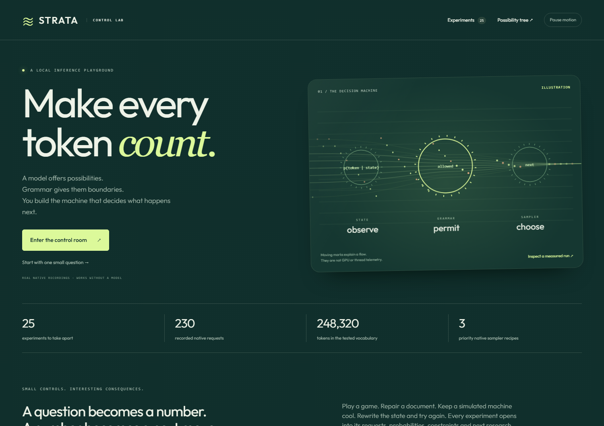
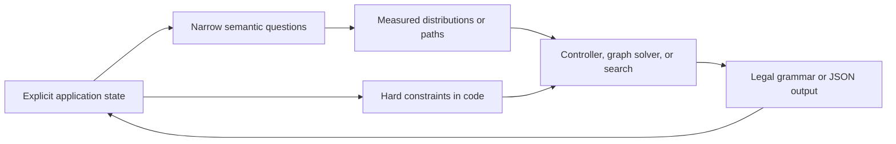

# Strata Control Lab

An educational control room for turning model preferences into inspectable
program decisions. **25 experiments** connect raw logprobs, native GBNF/JSON,
sampler order, games, state injection, semantic observers and bounded search.
An animated index starts simple; each result opens into its exact measurements,
mathematics and next research question.

The first goal is understanding and control. The lab demonstrates mechanisms and
records measurements; it does not claim a universally better model, calibrated
truth probabilities, or a measured hardware roofline.



## Start without a model

Use a checkout of **`work/control-lab`**. Its logprobs base is
`2243cb1c5b1a87270731d8b8a76e4af001f96f97`; its merged sampler dependency is
`450285f3c90748057a02648345e6c3973519a710`. It is separate from the Responses
contribution. The [current receipt](control-lab-evidence/RESEARCH_RECEIPT.md)
records the source, native binary, tested model, commands and limitations;
the [initial eleven-page receipt](control-lab-evidence/RECEIPT.md) remains historical evidence.

Windows PowerShell, from this checkout's root:

```powershell
python -m venv .venv-lab
.\.venv-lab\Scripts\python.exe -m pip install -r examples/control_lab/requirements.txt
.\.venv-lab\Scripts\python.exe -m examples.control_lab
```

Ubuntu / Linux, from this checkout's root:

```sh
python3 -m venv .venv-lab
.venv-lab/bin/python -m pip install -r examples/control_lab/requirements.txt
.venv-lab/bin/python -m examples.control_lab
```

Open **http://127.0.0.1:8876**. Keep the terminal open. If that port is occupied,
add `--port 8877` and open that port instead. No Node build, database, external
website, GPU or downloaded model is needed to replay the committed native data.
The initial Python dependency installation needs package access; after that,
recorded mode and all local assets work without a network connection. There is
no font CDN, analytics service or automatic remote model fallback.

## Five-minute tour

1. The index has filters and search. **Pause motion** freezes its illustration;
   reduced-motion preferences are honored automatically.
2. Open **Choice**, leave **Recorded native run**, and press **Run experiment**.
   Switch between raw vocabulary probabilities and weights within the answer set.
3. Open **Grammar branches**. Select a phrase, then inspect its individual tokens.
4. Open **Sampler engine**. Compare Min-P before/after temperature, then select
   **GBNF + XTC gate on** or **Strict JSON + Top-N-Sigma**. Click a token to see
   its raw model score, final selection probability and full-vocabulary stage counts.
5. Open **Tic-tac-toe** or **Cooling loop**. Run, then step or play the completed
   trajectory. These playback controls do not actuate hardware or steer an active request.
6. Open **State controller** for manual `inspect → edit → test → finish`
   transitions, or **Sampler sandbox** to move dials on a disclosed synthetic row.
7. Expand a receipt or download JSON. Open **Possibility tree** for 20 research
   directions, including eight deliberately unusual experiment protocols.

Recorded mode looks up the **exact request** by a SHA-256 key. Editing a prompt
that has no recording produces a clear error. It never substitutes a canned
answer for a new prompt. Thresholds and graph constraints can be changed over the
same recorded measurements without rerunning inference. Downloaded JSON contains
the complete receipt, including whether it was replayed or generated live.

## Connect your local or LAN model

Start the native Strata server built from **`work/samplers`** (or this dependent
checkout), including its GBNF compiler and JSON validator. Follow the
[sampler build and API instructions](SAMPLERS.md) and
[model launch instructions](LOGPROBS.md#run-it-against-your-model).
The older logprobs checkpoint can run the foundation pages, but cannot return
the native sampler receipts required by **Sampler engine**.
The lab's optional FastAPI process is only an HTTP client of that server.

Set the address **before** starting the lab. For a Strata server on llm-49:

```powershell
$env:STRATA_BASE_URL = 'http://llm-49:8080'
$env:STRATA_API_KEY = 'your-configured-strata-key'
.\.venv-lab\Scripts\python.exe -m examples.control_lab
```

```sh
export STRATA_BASE_URL=http://llm-49:8080
export STRATA_API_KEY=your-configured-strata-key
.venv-lab/bin/python -m examples.control_lab
```

Now select **Live model**. Edit the state or question and run again. The Strata
key stays in the Python process, not the browser. It is not written into the
downloaded receipts. The UI binds only to loopback; the inference server keeps
its existing authentication and CORS. Use `--api-key` whenever Strata itself
listens beyond loopback. A plain HTTP LAN connection provides no encryption;
an SSH tunnel to a loopback Strata server is another connection option.

**Stop** closes the active HTTP connection. Strata's existing cancellation and
output-draining logic owns engine cleanup. The lab never starts a GPU worker or
changes MTP configuration. Live UI requests are not saved to disk automatically.

An older server may lack logprobs, native grammar/JSON or `ordered-host-v1`
inspection. Its error is shown as a failed run. The lab does not fabricate a
weaker success. Select **Live model** separately on a page. Pages that issue model calls
can rerun their built-in workload against your compatible server; pages with
editable inputs also let you change the request. The three analytic pages
remain analytic in either mode and make no model requests. **Draft & target**
always inspects the separately recorded native speculation diagnostics.

## Twenty-five experiments

Every page has a simple input, a visible result, an explanation of the
mathematics, the next useful experiment, and downloadable request/response data.

| Page | Try this | What it teaches |
| --- | --- | --- |
| Choice | Route a bug report; compare complete labels with the fast probe | One target row can expose competing one-token labels. An omitted label is unknown, not zero. |
| Yes / no | Ask whether a customer explicitly requests cancellation | A narrow semantic probe is a numerical feature your code can use. |
| Rubric score | Define minor, degraded and blocked incident levels | A continuous rating can be the expectation of an explicit discrete rubric. |
| Grammar branches | Compare two groups of multi-token next steps | Follow conditional token scores along each path and aggregate finite groups. |
| State controller | Read, edit, test, finish | Code derives legal answers from state; the model ranks or generates within them. |
| Source ranking | Rank three source blocks without rewriting them | Independent requests provide relevance features; HTTP concurrency is not GPU batching. |
| Document graph | Inspect reading-order and caption links | Model edge weights plus hard graph constraints preserve immutable source text. |
| Scene search | Generate JSON, check geometry, compare a code proposal | Generation, validation, semantic measurement and human visual judgment have different roles. |
| Token inspector | Run the ten API examples, including tools and reasoning | Generated answer scores, hidden syntax, streaming, grammar and strict JSON have distinct boundaries. |
| Draft & target | Inspect the recorded rejected MTP proposal | Proposal, verification, actual emitted output and replay scores describe different computations. |
| Latency frontier | Compare plain, scored, GBNF and JSON requests | Measure cost and cache effects before selecting an optimization. |
| Sampler engine | Inspect six native recipes plus three GBNF/JSON combinations | Grammar selects legal support; ordered operators shape its distribution; raw scores retain their meaning. |
| Sampler sandbox | Move Min-P, temperature, sigma and XTC dials | Operator ordering is an algorithm. DRY-like and feedback variants are explicit teaching simulations. |
| Tic-tac-toe | Step native moves against exhaustive minimax | Legality and strategy are separate. Compare model decisions with an exact outcome oracle. |
| Chess microscope | Inspect a mate-in-one position and the full legal grammar | Code proves move legality and checkmate. Letter-label scores and a UCI generation are different prompts. |
| Hidden information | Compare check/bet with exact toy poker payoffs | Model preference, hidden-state belief and expected utility are different objects. |
| Cooling loop | Step a changing load, model action and hard next-state limit | A one-step shield is not a stability proof. Compare against ordinary hysteresis control. |
| Job scheduler | Follow a four-job queue with prerequisites and deadlines | Code derives admissible actions from state; model-call cost is part of the scheduling problem. |
| Context surgery | Compare appended correction, replaced history and explicit current state | These are real API prompt interventions. No arbitrary KV tensor editing is implemented. |
| Semantic observer | Inspect three narrow probes over evolving reports | A numerical semantic state vector can drive a controller without being a calibrated joint belief. |
| Calibration bench | Move an abstention threshold and inspect label swapping | Six disclosed fixtures teach Brier score and coverage; they are not a held-out calibration benchmark. |
| Active inspection | Choose a diagnostic test and inspect its posterior | Synthetic likelihoods drive exact information gain; a native answer supplies the subsequent action. |
| Program search | Change the cost tradeoff among six typed scene programs | Code rejects invalid geometry; native text probes rank survivors; rendering remains visible to humans. |
| Cost frontier | Change assumed bandwidth, power and forward-pass time | Actual selector timings and hypothetical engineering budgets must stay distinguishable. |
| Possibility tree | Explore 20 implementation and research branches | Each proposal needs a baseline, budget and failure criterion before a performance claim. |

The controller simulates a toy coding task. Its actions never execute arbitrary
shell commands. The scene renderer draws two typed shapes from JSON; it does not
evaluate model-generated JavaScript, SVG or Python. The semantic scorer reads the
scene description, not its rendered pixels. The human visual selector remains a
browser-local annotation and is not treated as model evidence.

## Can two grammars have probabilities?

For the finite case here, list each group's literal strings. The lab builds GBNF
for those strings and evaluates one constrained token path for each, using the
same prompt. It appends a common newline so one candidate is not a byte-prefix
of another. A single union-grammar generation is shown separately.

For candidate tokens `t1…tk`:

```text
log P(path | prompt) = sum_i log P(t_i | prompt, t_1…t_(i-1))
group log mass      = logsumexp(log P(path) for measured paths in that group)
relative group mass = exp(group log mass - logsumexp(all group log masses))
```

The native raw logprobs are measured **before the grammar mask**. A low-scoring
forced candidate therefore keeps its low raw score instead of turning into
100% just because it is legal. This is the useful reason for scoring a selected
token outside top-N. Forcing `Z` on an A/B prompt was a correctness test of that
behavior; it was not the application itself.

Important scope: this sum covers the listed emitted token paths. It does not
enumerate alternative tokenizations, synonyms you omitted, an infinite grammar
language, or an EOS probability. Overlapping groups are rejected to prevent
double counting. Grammar-greedy generation can differ from the highest-scoring
whole path. Average logprob, raw path probability and normalized candidate weight
are different quantities; the receipt preserves all of them.

## What goes beyond a classifier API?

The individual Choice/Yes-No/Score pages are classifier-style readouts from a
generative model. That is a useful baseline, not new computational expressivity
or a claim to reproduce Jev's trained decision model.

The interesting composition is the observable loop:



The distribution can become a compressed numerical observation vector. The
program still controls admissibility, immutable data, branch selection and the
next question. Strata exposes the model's generation machinery as well: raw
target scores, native output constraints, and separately labeled speculative
diagnostics. Those are the model-control mechanisms this lab makes inspectable.

[TypeSafe's primitive documentation](https://docs.typesafe.ai/primitives) is an
interface reference for Choice, Score and Noul. Its [confidence documentation](https://docs.typesafe.ai/confidence)
explains the derived Choice statistic. This lab calls that statistic
**peakedness**, to distinguish a summary of the same distribution from external
evidence of reliability. Correlated questions can share errors; multiplying
their outputs does not establish a calibrated workflow-success probability.

## Samplers, state and cache control

The priority recipes are native: `min_p → temperature`,
`top_n_sigma → temperature`, and `top_k → min_p → xtc → temperature`.
The last recipe includes the user's top-k/min-p support selection. The page also
compares the reversed temperature order and an XTC gate deliberately forced on.
The [exact operator definitions](SAMPLERS.md) specify thresholds, population
standard deviation, tie breaking, RNG lanes and capability errors.

Grammar is applied before those operators. The lab includes native literal-GBNF
and strict-JSON combinations, with every selected token's raw logprob and
post-sampling probability. Raw top-N can omit legal candidates; it is not used
as the vocabulary from which the sampler chooses. The native inspection covers
all 248,320 tokens in the tested model.

This first implementation uses CPU reference selection after the existing GPU
forward pass. Profiled requests temporarily use target-only decoding; ordinary
requests retain their normal native path. It is an inspectable foundation for a
GPU implementation, not an acceleration claim. DRY, DynaTemp and Mirostat are
not native capabilities of this branch. The sandbox's explicitly disclosed
sequence-penalty, entropy-temperature and expected-surprise formulas teach
related ideas without advertising compatibility with those production samplers.

**Context surgery** sends three actual request texts: append a correction,
replace obsolete text, or inject current structured state. The native service
decides whether to reuse a valid prompt prefix. The lab does not rewrite KV
tensor bytes, assign a new meaning to an old prefix, or send a grammar update
mid-token. Arbitrary context surgery must account for positional state and this
model's recurrent state as well as KV; cache correctness precedes speed.

The native recordings deliberately preserve disappointing answers. Tic-tac-toe
can lose against minimax. The chess UCI generation chooses a legal stalemate
while a different six-label prompt favors a mating move. That is a useful
representation-sensitivity experiment, not evidence that one unchanged
distribution both chose and rejected the same move.

Operator references and their pinned versions are in [SAMPLERS.md](SAMPLERS.md).
[python-chess](https://python-chess.readthedocs.io/en/latest/) supplies legal move
generation and checkmate checks, not a chess-strength evaluation engine.
[Mirostat's paper](https://arxiv.org/abs/2007.14966) describes sampled-surprise
feedback; the sandbox intentionally exposes a smaller expected-surprise model
whose eight-token entropy ceiling makes controller windup visible.

## Timing, costs and numerical paths

The native capture used an RTX 4090, Qwen3.8-Flash-Next IQ1_M, int8 KV, a 4096-token
context and target-only serving, via an SSH tunnel from Windows to llm-49. All
**101 foundation requests** and **129 research requests** form the 230 canonical
native recordings in the [capture suite](control-lab-evidence/capture-results.json).
The research capture uses the separately qualified sampler binary; its hash and
source identity are in the [research receipt](control-lab-evidence/RESEARCH_RECEIPT.md).
Three fast single-row examples took approximately **0.91–0.95 seconds** each on
that setup. Complete-label and graph/scene workflows make multiple calls and are
slower. Prompt/cache conditions and exact timings are in each receipt.

There is no paid endpoint in this demo, but local inference is not cost-free.
Energy, hardware and utilization matter. The lab does not claim a fraction of a
cent per step or a speedup over a multimodal model without a matching measurement.
Textual state and a one-token label can avoid long generated explanations; the
prefill and model execution still have to happen.

The initial foundation performance suite measured medians around 291 ms for plain output,
296 ms for selected-only scores, 430 ms for top-5, 315 ms for top-20, 321 ms for
GBNF plus scores, and 1134 ms for JSON plus scores. There were only three
alternating warmed repetitions; JSON generates a different, longer output and
can change prompt/cache behavior. These values are observations, not isolated
kernel overhead estimates or universal rankings.

MTP, suffix, coupled sampling and teacher-forced replay remain labeled separate
paths. Small numerical differences across those paths are expected. The
original same-tensor numerical oracle still checks the reducer tightly; a
cross-path comparison measures drift without pretending the computations are
identical. See [the original evidence](logprobs-evidence/RECEIPT.md).

## Test or capture your own evidence

```sh
python -m pip install -r examples/control_lab/requirements-test.txt
python -m pytest examples/control_lab -q
python -m playwright install chromium
# With the lab already running:
python -m examples.control_lab.check_browser --base-url http://127.0.0.1:8876
python -m examples.control_lab.check_research_browser --base-url http://127.0.0.1:8876
# With a live Strata server:
python -m examples.control_lab.capture --base-url http://127.0.0.1:8080 --output evidence/my-lab
```

Use the lab virtual environment's Python for these commands. `check_browser
--live` also stops an in-flight native request and checks the next one. The
capture harness records only the built-in public examples; it does not harvest
your other conversations. Unit-test scores are explicitly synthetic; committed
UI recordings have native provenance. Testing the webpage alone is not native
inference qualification, so those receipts are kept separate.

To check a genuinely disconnected replay, start another lab process with
`STRATA_BASE_URL=http://127.0.0.1:1` and `--port 8877`, then point the browser
checks at it. The research browser checker blocks and records external browser
requests. Its results say whether that test used an unreachable model server;
use `--expect-offline` to check that a live request really fails to connect
before running the recorded-mode suite.

The [roadmap](CONTROL_LAB_ROADMAP.md) maps the improvement branches and their
measurement gates. Per-token grammar replacement, arbitrary grammar-language
mass, draft top-N HTTP output and a true hardware roofline are future work.
