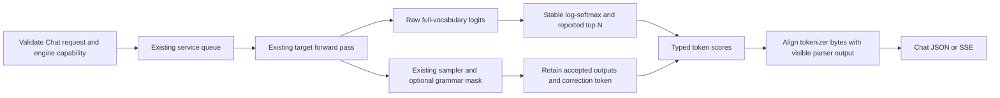

# See which answer tokens your local model preferred

This branch implements [Strata issue #675](https://github.com/Niko1221/Strata/issues/675):
`logprobs` and `top_logprobs` on `/v1/chat/completions`, in JSON and streaming responses.
It also combines scores with native GBNF and JSON Schema constraints.

**Try the recorded demo without installing a model:**

```sh
python tools/demo_logprobs.py --recorded
```

For “is the sky blue? A) yes B) no”, the local Qwen model on llm-49 returned:

| Next token | Full-vocabulary probability |
| --- | ---: |
| `A` | 96.254463% |
| ` A` | 3.637240% |
| `The` | 0.025150% |
| `B` | 0.015391% |
| `Answer` | 0.010637% |

The exact floats, token bytes, usage and timings are in the
[real response](logprobs-evidence/initial/json-response.txt).
`exp(logprob)` converts the natural logarithm into a probability. The leading
space in ` A` is part of a different token. These are next-token probabilities,
not measured confidence that the answer is true.

## What can an application do with this?

| Use | Small example | What the score adds |
| --- | --- | --- |
| Choose a labeled action | `B` = build, `T` = test, `D` = documentation | Inspect competing labels from the same target head row. |
| Flag an ambiguous decision | Route A versus route B | A small gap can trigger an application-defined review or follow-up. |
| Compare prompts or models | Send the same labeled question to two models | Compare distributions, not just the winning string. |
| Inspect constrained output | Grammar allows only `Z` | See that the allowed token had low raw model probability. |
| Score a generated sequence | A longer answer | Sum the returned conditional logprobs, keeping token count and tokenizer fixed. |
| Understand speculation | MTP proposes a token and target verification rejects it | Compare separately labeled draft and target scores. |

A missing top-N alternative has **unknown probability**, not zero. `top_logprobs`
reports at most 20 tokens; it is not an arbitrary-label scoring endpoint.
Multi-token labels need scores conditioned on each proposed prefix. MTP/suffix
diagnostics already score the proposal rows the target actually verified.

If an application combines `A` and ` A`, or renormalizes A/B to sum to one, that
is its own label mapping or conditional calculation. The server's scores retain
the denominator over the entire target vocabulary.

## Run it against your model

Use the native engine built from this branch and point your existing Strata
config's `exe` at that binary. An older binary is rejected before streaming
headers when scores are requested. No extra inference service is needed.

For an existing configured checkout:

```sh
cmake --build build --target strata --parallel 8
python -m serve.server --engine strata --config strata.json --host 127.0.0.1 --port 8080
```

If you have not installed Strata, begin with [the existing setup guide](AI_SETUP.md).
Scoring itself needs no grammar dependency and no new server flag. Requests
without `logprobs:true` keep the unscored path. Do not point `exe` at an older
downloaded release after building this branch.

For GBNF or native JSON **with scores**, install the pinned compiler and validator,
then add the grammar option to your existing CMake configuration:

```sh
python tools/prepare_xgrammar.py --out dependencies/xgrammar
python -m pip install -r requirements-json.txt
cmake -S . -B build -DSTRATA_ENABLE_GBNF=ON -DSTRATA_XGRAMMAR_DIR=dependencies/xgrammar
cmake --build build --target strata --parallel 8
```

The compiler is fetched at build time. Ordinary scoring builds with grammar off.
Keep your existing CUDA/HIP, architecture and GGML options when configuring a
new build directory. The config still selects the model, tokenizer and GPU.

For another machine on your LAN, use Strata's existing `--host` and `--api-key`
options. On the client set `STRATA_API_KEY`; the demos use the same authentication
as every other `/v1` route. A Windows client talking to Linux inference does not
qualify Windows native inference.

### Windows PowerShell

Run from the checkout root. Change the address to your Strata server:

```powershell
$env:STRATA_BASE_URL = 'http://llm-49:8080'
$env:STRATA_API_KEY = 'your-configured-key'
python tools/demo_logprobs.py --case decision

$headers = @{ Authorization = "Bearer $env:STRATA_API_KEY" }
$body = Get-Content -Raw -Encoding UTF8 examples/logprobs/decision.json
$reply = Invoke-RestMethod -Uri "$env:STRATA_BASE_URL/v1/chat/completions" -Method Post -Headers $headers -ContentType 'application/json' -Body ([Text.Encoding]::UTF8.GetBytes($body))
$reply.choices[0].logprobs.content[0].top_logprobs | ForEach-Object {
    [pscustomobject]@{ Token = $_.token; Percent = 100 * [Math]::Exp($_.logprob) }
}
```

### Ubuntu / Linux

```sh
export STRATA_BASE_URL=http://127.0.0.1:8080
export STRATA_API_KEY=your-configured-key
python tools/demo_logprobs.py --case decision
curl -sS "$STRATA_BASE_URL/v1/chat/completions" \
  -H "Authorization: Bearer $STRATA_API_KEY" -H 'Content-Type: application/json' \
  --data-binary @examples/logprobs/decision.json
```

### More examples

Each file is an ordinary HTTP request. For example:
`python tools/demo_logprobs.py --case grammar`.

| Case | Request file | Expected behavior |
| --- | --- | --- |
| `decision` | [One-token A/B](../examples/logprobs/decision.json) | Selected score plus five alternatives; temperature zero still has probabilities. |
| `router` | [Build/test/docs labels](../examples/logprobs/router.json) | Grammar limits the allowed action; raw probabilities keep their original meaning. |
| `ambiguity` | [A preference without supporting information](../examples/logprobs/ambiguity.json) | Inspect the model's preferences; no promised numerical threshold. |
| `stream` | [A longer streamed answer](../examples/logprobs/stream.json) | Each visible token receives a score through the same execution as JSON. |
| `grammar` | [Force `Z`](../examples/logprobs/grammar.json) | The selected token gets a score even outside raw top-N. |
| `json-schema` | [JSON decision field](../examples/logprobs/json-schema.json) | Native constraints plus mandatory validation of the original schema. |
| `reasoning-json` | [Think, then answer as JSON](../examples/logprobs/reasoning-json.json) | Thinking is excluded from content scores; the native budget closes thinking. |
| `tool-call` | [Client-owned echo tool](../examples/logprobs/tool-call.json) | Tool syntax is excluded from content scores. Strata returns the call to the client. |
| `tool-result` | [Continue after the tool result](../examples/logprobs/tool-result.json) | Incoming tool text is context; only newly generated answer tokens are scored. |
| `selected-only` | [No alternatives](../examples/logprobs/selected-only.json) | Selected scores with `top_logprobs:0`. |

The first token of JSON may be `{`, not the decision field. Request enough
tokens for the complete JSON object. Structured output that ends prematurely
fails validation; it is never repaired or silently reserialized after scoring.

## How the implementation works



`logp(token) = logit(token) - logsumexp(all target logits)`. Scores precede
temperature, top-k/top-p/min-p, penalties and grammar masking. Returning fewer
alternatives does not change normalization. Temperature zero does not turn the
chosen token's raw probability into 100%.

The CPU reference implementation copies each retained target row and computes
the normalizer in FP64. It performs no additional model forward pass. A single
output token still requires prompt reading or cache reuse. The first-token test
produced zero MTP drafts. Requests without scores do not copy/reduce score rows.

Token bytes, including fragments of UTF-8 characters, are preserved. The service
does not retokenize the answer. Reasoning, tool envelopes and EOS are not added
to `logprobs.content`. A token partly hidden by the legacy parser and partly
visible has no honest substring probability: that boundary produces an explicit
error. Ordinary reasoning/tool token boundaries and native scoped grammar are
tested. Logprobs cannot score a Python-injected reasoning wrap-up; disable that
budget or use the native JSON budget in the example.

## Draft versus target scores and ngrams

Try `python tools/demo_logprobs.py --proposal` for a second recorded demo.
In that window MTP gave proposed token 198 about **52.39%**, but target verification
gave it **0.000428%** and emitted a different token. The draft used a 40,525-token
vocabulary; the target used 248,320. The separate sources and normalizers matter.
See the [recorded comparison](logprobs-evidence/native/edges/oracle.json).

Standard Chat scores always describe the target's retained output. Optional
server-owned evidence paths add proposal diagnostics:

```sh
export STRATA_LOGPROBS_TRACE=/absolute/path/proposals.jsonl
python -m serve.server --engine strata --config strata.json --host 127.0.0.1 --port 8080
```

For scored requests the trace separates:

- MTP's selected draft probability, with its draft vocabulary size. Ordinary
  greedy drafts use their raw draft distribution; coupled drafts report the
  existing post-sampling distribution. These are not interchangeable scores.
- Each proposed token's **raw target probability** conditioned on that proposal's
  prefix, even after the first mismatch. Their logprobs sum to the candidate's
  sequence logprob for the evaluated portion.
- Tokens actually retained and emitted, using target scores for the real output
  prefix. Rejected proposal rows never enter Chat content scores.

Suffix lookup has no model distribution of its own. Its candidate receives target
scores during verification. Traces record scored/proposed length, completeness,
EOS inclusion and acceptance. Draft scores are float scalars; an underflowed zero
has a null logprob, not an invented finite value. Draft top-N is not exposed yet.

`STRATA_LOGPROBS_RAW` additionally records bounded raw numerical fixtures for the
oracle tests. It is an optional diagnostic with extra I/O, not needed by clients.

## Separate follow-up: change grammar after each token

[The steering plan](GRAMMAR_STEERING_PLAN.txt) describes a separate, default-off
feature with token acknowledgements. It will work with or without logprobs.
It is **not implemented by this branch's Chat endpoint**. The initial design
uses target-only generation; speculative steering requires explicit rollback
and commit boundaries. No ordinary streaming request accepts a mid-stream grammar
replacement today.

## Validation and limits

See the [test receipt](logprobs-evidence/RECEIPT.md) for exact tested configurations,
commits, commands, results and timing measurements. Run the portable tests with:

```sh
python -m unittest serve.test_logprobs
cmake --build build --target logprobs_test
ctest --test-dir build -R logprobs_test --output-on-failure
python tools/qualify_logprobs.py --config strata.json --output evidence/logprobs
```

Configure `STRATA_BUILD_TESTS=ON` to build the numerical test. The native harness
uses a real configured model and tests constraints too, so it requires a grammar
build and `requirements-json.txt`. Synthetic transport fixtures are labeled as
such and do not substitute for native inference evidence.

This is a Chat logprobs contribution. The separate Responses/Codex contribution
remains on [work/gbnf](https://github.com/CC-David-CC/Strata-a5500/tree/work/gbnf).
