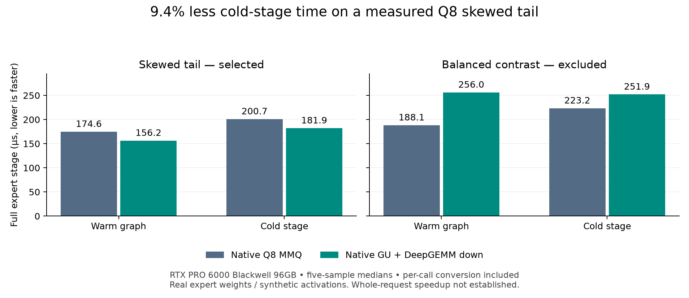

# Experimental Q8 DeepGEMM prefill tails

**Cold full expert-stage time fell from 200.7 to 181.9 µs: 9.4% less time.**
This is a component improvement on one measured skewed four-expert group,
including weight conversion. Whole-request prefill time was essentially flat.



This fork of [Strata](https://github.com/Niko1221/Strata) uses
[DeepSeek's DeepGEMM](https://github.com/deepseek-ai/DeepGEMM/tree/b64107f2b9599ca76445b7f62eedf66bae1d095b)
for an optional BF16 **down product** after native Q8 gate/up and SwiGLU.
DeepGEMM supplies the kernel; this contribution supplies the native adapter,
narrow dispatch rule, and measurements. No experts are removed or cached as
BF16. Original Q8 weights and F32 activations are converted on every call.

## Scope and measured results

Hardware: **RTX PRO 6000 Blackwell Workstation Edition, 96GB, SM120, 188 SMs**;
Ryzen 9 7950X; 128GB installed RAM; Ubuntu 24.04.5; NVIDIA 595.91.07; CUDA
13.2.86. DeepGEMM pin: `b64107f2b9599ca76445b7f62eedf66bae1d095b` (`nv_dev`).
Engine measured: stock 1.40 `1cbcacbcae2953f3be9edc46369f0c875bc6ab8b` plus
the adapter. Publication rebased onto `82f46a8c8f475f001ad76d92f58f4a4f8ffb0253`;
intervening changes did not alter native engine or build sources.

Real Unsloth Qwen3.8-Flash-Next Q8_0 expert weights and recorded route counts;
synthetic F32 activations, seed 761. Five timing samples per arm, median shown.
Warm samples replay 16 stages per graph. Cold samples replay one stage after a
400MiB device fill, outside timing, larger than this card's 128MiB L2.
Routing, incoming PCIe transfers, common gather, and final route-weighted
combination are excluded equally. Conversion, gate/up, SwiGLU, down, packing,
and unpacking are included.

| Full stage | Native warm | Adapter warm | Native cold | Adapter cold |
|---|---:|---:|---:|---:|
| Skewed: layer 7, counts [1,1156,277,30] | 174.6 µs | **156.2 µs** | 200.7 µs | **181.9 µs** |
| Balanced contrast: layer 3, counts [585,1170,767,585] | 188.1 µs | 256.0 µs | 223.2 µs | 251.9 µs |

The losing balanced case is excluded by the production dispatch rule. Only
Q8_0 groups of exactly four experts, maximum 512–1536 rows, with
`4 * max_rows >= 3 * total_rows`, use the adapter. This is an empirical pilot
policy, not a universal speed guarantee. All other groups retain native MMQ.

### Whole requests: useful coverage, no causal speedup claim

Actual input tokens; 1,024 generated tokens; MTP T4; FP16 KV; 8,192-token
prefill chunks; 15,472 GPU expert slots; 56GiB resident-RAM budget; adaptive
rotation enabled. Both arms use the same binary and reserve the same ~50MiB
scratch. Each row is one ordinary, unprofiled observation.

| Input | Adapter | Replacements | Prefill | Decode | Total |
|---|---|---:|---:|---:|---:|
| 32,768 | Off | 0 | 7.8958 s | 147.16 tok/s | 14.8597 s |
| 32,768 | On | 1 | 7.8953 s | 149.07 tok/s | 14.7694 s |
| 131,072 | Off | 0 | 31.9631 s | 143.38 tok/s | 39.1234 s |
| 131,072 | On | 8 | 31.9764 s | 148.19 tok/s | 38.9036 s |

**Generated tokens differ**, first at zero-based positions 7 and 84.
BF16 activations replace native q8_1 activation quantization in this down
product, so this changes arithmetic. Decode trajectories and measured work
can change; the apparent decode/request differences do not establish a
performance improvement. This branch changes prefill, not decode or MTP.
The rare stage win is retained independently of overall time.

## Validation completed

- Native adapter matched the Python DeepGEMM hybrid bit-for-bit on both tested
  four-expert groups.
- Finite outputs, zero-row preservation, and graph replay with changed input
  passed. The independent F32 dequantized-weight oracle screen required
  relative RMS error below 0.04; this is a screen, not a proved error bound.
- Compute Sanitizer `memcheck`: **zero errors**, exit 0, on the stage harness.
  Sanitizer timings are excluded from the chart. Full-model cancellation,
  racecheck, and a portability matrix have not been tested.
- Default-OFF and opt-in native engine builds passed. No Torch or Python
  dependency is introduced into the engine.
- All four full-model requests completed with exactly 1,024 output tokens.
  A separate short pure-arithmetic function check passed; the long generated
  module was not executed or scored.

## Build and use

This is an **experimental, default-OFF, CUDA-only** pilot for exactly SM120
with 188 SMs. It is not intended for the RX 5500 XT, Tesla P4, RTX 5070, or a
general Blackwell device. Unsupported opt-in devices fail clearly. Keep the
external DeepGEMM checkout/installation pinned; its header API is not stable.

Set `DG_INCLUDE` to the installed DeepGEMM `include` directory containing
`deep_gemm/impls/sm120_bf16_gemm.cuh`; set `GGML_SOURCE` to GGML commit
`3cf03257` as used for these measurements. Configure from the Strata root:

```sh
cmake -S . -B build-dg -DCMAKE_BUILD_TYPE=Release \
  -DSTRATA_ENABLE_CUDA=ON -DCMAKE_CUDA_ARCHITECTURES=120 \
  -DSTRATA_NATIVE_EXPERTS=ON -DSTRATA_BUILD_TESTS=OFF \
  -DSTRATA_BUILD_CONVERSATION_TESTS=OFF \
  -DCMAKE_POSITION_INDEPENDENT_CODE=ON \
  -DSTRATA_GGML_DIR="$GGML_SOURCE" \
  -DSTRATA_DEEPGEMM_TAIL=ON -DSTRATA_DEEPGEMM_INCLUDE_DIR="$DG_INCLUDE"
cmake --build build-dg --target strata -j 16
```

The adapter translation unit targets `sm_120f` explicitly. CUDA 13.2 was used.
Enable with `STRATA_DEEPGEMM_TAIL=1`. For matched-reservation A/B, also set
`STRATA_DEEPGEMM_TAIL_RESERVE=1` in both arms and toggle only the first flag.
With both flags absent, no adapter scratch is allocated. To remove the code
entirely, configure with `-DSTRATA_DEEPGEMM_TAIL=OFF`.

## Reproduction and evidence

[Stage samples](stage-results.json), [request observations](request-results.json),
and [weight hashes / scalar-oracle checks](weight-manifest.json) are compact
evidence. No model weights or profiler archives are included.

The [reproduction directory](reproduce/) contains the stage harness and the
full-request harness. Run on an otherwise idle GPU. A GPU PyTorch installation,
NumPy, `gguf`, and the pinned DeepGEMM Python package are needed **only by the
test harness**. From the Strata root, set `R` and compile the bridges:

```sh
R=docs/experiments/q8-deepgemm-tail/reproduce
nvcc -shared -Xcompiler=-fPIC -std=c++20 -O3 -arch=sm_120 -Iinclude \
  "$R/compact_bridge.cu" build-dg/libstrata_mmq.a \
  build-dg/ggml/src/libggml-base.a -lcublas -lcudart \
  -o "$R/native-prefill-components.so"
g++ -shared -fPIC -std=c++20 -Iinclude -I/usr/local/cuda/include \
  "$R/bridge.cpp" build-dg/libstrata_dg_tail.a \
  -L/usr/local/cuda/lib64 -lcudart -lcuda -o "$R/native-tail.so"
python "$R/prepare_weights.py" /path/to/Q8_0
python "$R/bench_native.py"
```

For memory checking, run the same harness under `compute-sanitizer --tool
memcheck --error-exitcode 97` in a **separate copy** of the reproduction
directory so its measurements cannot overwrite ordinary results. The model
harness uses private stdin/stdout `--serve`, with no public listener; edit
`plan.example.json` asset/build paths, save as `plan.json`, then run `case.py`
once for each listed case. It requires Linux `/proc`, a raised memlock limit,
and sufficient RAM/VRAM. It does not install or alter model assets.

Potential next steps are fused gather/conversion and smaller scratch buffers.
Neither is implemented or credited with a speed gain here.
