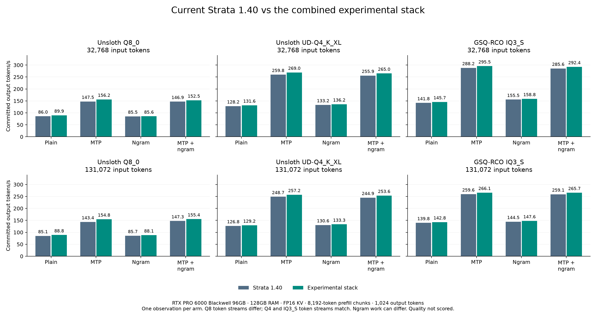
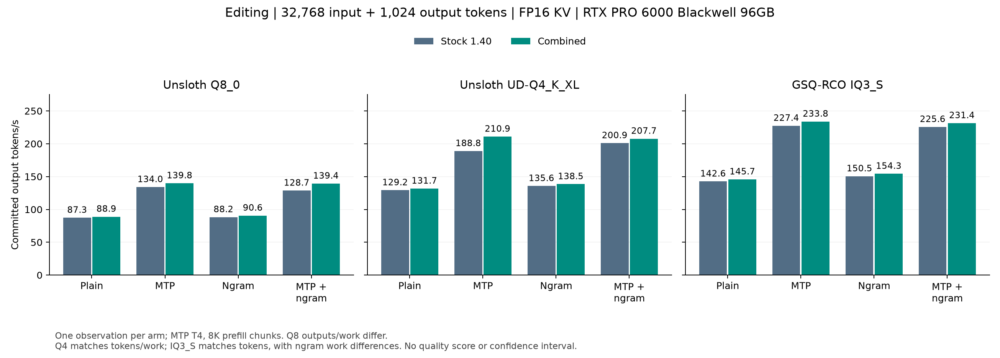
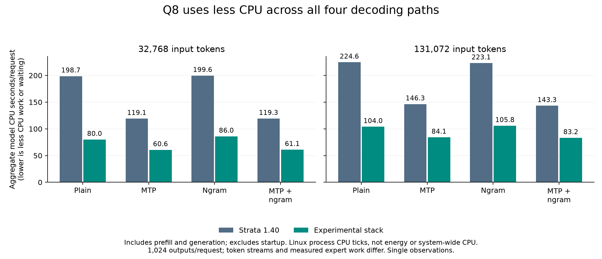
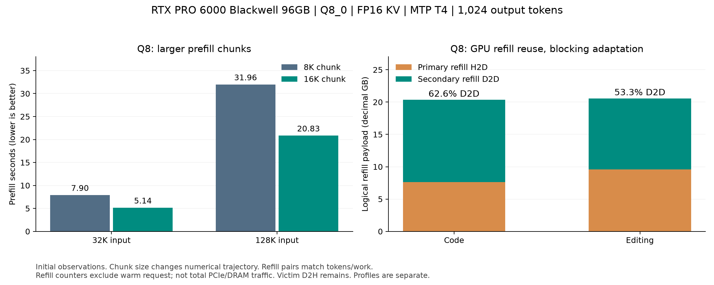

# RTX PRO combined experimental gains

This fork combines opt-in transfer, scheduling and kernel experiments on top of
[Strata](https://github.com/Niko1221/Strata). The listed validation checks passed on the measured GPU. This page describes
experimental fork profiles; it does not describe upstream defaults.

## Hardware and test

RTX PRO 6000 Blackwell Workstation Edition, **96 GB**, SM120; Ryzen 9 7950X;
128 GB installed RAM; Ubuntu 24.04.5; CUDA 13.2; driver 595.91.07.
This is not an RTX 5070 or an AMD RX 5500 XT.

Models: **Unsloth Q8_0**, **Unsloth UD-Q4_K_XL**, **GSQ-RCO IQ3_S**.
The comparison covers 32,768 and 131,072 actual input tokens, then 1,024 output
tokens, with FP16 KV. Plain, MTP T4, ngram and MTP+ngram were each measured.
Both arms use 8,192-token prefill chunks. Timings were collected without a profiler.

Stock engine: native 0.1.40 commit `1cbcacbcae2953f3be9edc46369f0c875bc6ab8b`.
Combined source: `55563d3f3b51d2c59a008932c9f004029948bcd8`, based on upstream
`82f46a8c8f475f001ad76d92f58f4a4f8ffb0253`.
The later upstream changes in that interval concern serving/setup, rather than
the native kernels used in this comparison.

## Initial decode results

All **48 requests completed**: three models, two input lengths, four paths and
two engines. All 24 initial decode comparisons improved. These are single
observations, not confidence-bounded estimates or model-quality scores.

MTP T4 summary, in committed output tokens per second:

| Model | 32K stock | 32K combined | Change | 128K stock | 128K combined | Change |
|---|---:|---:|---:|---:|---:|---:|
| Q8_0 | 147.5 | 156.2 | +5.9% | 143.4 | 154.8 | +8.0% |
| UD-Q4_K_XL | 259.8 | 269.1 | +3.5% | 248.7 | 257.1 | +3.4% |
| GSQ-RCO IQ3_S | 288.2 | 295.5 | +2.5% | 259.6 | 266.1 | +2.5% |

Q4 and IQ3_S matched all 1,024 output tokens in every pair. Three IQ3_S ngram
pairs differed in a work counter despite matching output. Q8 outputs differed:
the DeepGEMM tail uses BF16 intermediates in place of native Q8 activation
quantization. Q8 timings therefore compare complete runs with different
trajectories; they do not establish an exact-output kernel speedup or a quality
equivalence claim.

## Editing at 32K

MTP T4: Q8 **133.99 -> 139.82 tok/s**; Q4 **188.84 -> 210.87 tok/s**
(**+11.7%**); IQ3_S **227.40 -> 233.80 tok/s**. Q4/IQ3 MTP pairs match
all 1,024 tokens and measured work. Q8 differs. IQ3_S ngram/combined pairs
match tokens but have speculation-counter differences. Full values for every
path are in the followup evidence. These observations do not establish confidence
intervals or quality equivalence.

## CPU use

Q8 MTP at 32K used **119.13 -> 60.63 CPU seconds**, a **49.1% reduction**.
At 128K the reduction was **42.5%**. These are aggregate CPU times across engine
threads, from Linux process ticks, not wall time or energy measurements.

## Separate configuration and bandwidth alternatives

These results are not added to the decode percentages above.

| Experiment | Control | Candidate | Result |
|---|---:|---:|---|
| Q8 32K prefill, 8K -> 16K chunk | 7.8954 s | 5.1437 s | 34.8% less prefill time |
| Q8 128K prefill, 8K -> 16K chunk | 31.9632 s | 20.8331 s | 34.8% less prefill time |
| Q8 code, secondary cache -> GPU refills | 146.05 tok/s | 150.16 tok/s | +2.8%; exact tokens and measured work |
| Q8 editing, secondary cache -> GPU refills | 129.81 tok/s | 130.20 tok/s | +0.3%; exact tokens and measured work |

The 16K chunks change arithmetic and output trajectory. With the default ring
capacity of 384, total Q8 request time was 11.93 s at 32K and 27.51 s at 128K.
Ring capacity 512 was slightly slower at 32K; it previously exhausted VRAM at
128K and is not selected.

GPU refills replaced **62.58%** of primary refill H2D payloads for code and
**53.33%** for editing with device-to-device copies. Warm-request counters were
subtracted. These are logical refill payload counts, not total PCIe or GPU DRAM
traffic. Primary victim D2H copies remain.

The bandwidth profile uses 14,704 primary slots plus 768 secondary slots and
blocking adaptation. It is a distinct alternative to the async fast profile.
Combining GPU refills with async/per-layer admission is currently rejected
because that joint source-lifetime contract has not been validated.

### Resident-RAM flag comparison

With primary slots held at 15,472 and **all missed experts computed on the CPU**,
the 56 GiB resident budget improved decode **52.52 -> 114.09 tok/s**, prefill
**43.72 -> 7.94 s**, and total request time **63.23 -> 16.93 s**. All 1,024 output
tokens matched. Placement/work counters matched except the file/RAM source
counters. The file-backed arm explicitly uses `--mmap-experts` without a resident
budget; the resident arm uses `--resident-budget-gib 56`. Both use blocking
adaptation and no buffer rotation. This is a distinct comparison from the fast
mixed CPU/GPU profile. Two incorrect control setup attempts were preserved,
then corrected before either completed benchmark arm; neither is counted as a
model failure or used in the result.

## Configuration and evidence

- [Explicit opt-in profiles](../../../configs/rtxpro-tested-gains/profiles.json)
- [Complete code matrix](matrix-summary.json)
- [All 37 completed followup measurements](followup-summary.json)
- [Native 0.1.40 traffic reference](native-profile/README.md)
- [Replay instructions](reproduce/README.md)
- [DeepGEMM component measurements](../q8-deepgemm-tail/README.md)

Eight ordinary component executions passed. All 48 code observations and
37 followup observations completed; two unchanged stock points were reused
and are marked in the code matrix.

[Publication checks](publication-checks.json) passed:

- Five Compute Sanitizer memcheck runs: duplex, per-layer exchanges, immutable
  miss cache, GPU refills and PDL parity, all zero errors. Four unchanged fixture
  results were retained; the PDL fixture was rerun after fixing its exit cleanup.
- Current-branch default-OFF build and eleven 8K/512-output model checks.
  Stock/combined default-off token streams match for all three models. Q8 also
  matches with DeepGEMM compiled out.
- STOP at 7, 19 and 65 observed tokens, followed by an arithmetic request and
  a complete fresh 512-token request, on async Q8, GPU-refill Q8, Q4 and IQ3_S.
  Q4/IQ3_S preserve exact next-request tokens.
- Two targeted Q8 controls: stock adaptive placement also differs after STOP
  (first difference 52); the combined build with fixed placement matches all
  512 next-request tokens. This is consistent with adaptive placement/arithmetic
  effects, not a proof of every internal state. Dynamic Q8 exact state parity
  remains unproven.
- All 23 refined DeepGEMM selector boundaries, invalid inputs and disabled
  construction checks.

The original PDL fixture passed numerical parity but leaked 60,373,504 bytes
in 16 allocations at exit. Its cleanup-only correction passed memcheck. Runtime
engine code did not change after the timing matrix. The failed test record was
preserved. Component memcheck does not cover every full-model kernel, and no
internal KV/recurrent/history digest or cross-hardware matrix was collected.

[Source equivalence](source-equivalence.json): the publication code is one
commit from upstream, with the tested source tree preserved and authors credited.
The [validation history](https://github.com/CC-David-CC/Strata-a5500/tree/research/q8-tested-gains-validation)
is separate from the clean publication history. Large traces and model files
are not included in this branch.

The long generated module was not executed or scored. A short arithmetic
function check passed for every completed request. No peak VRAM/RAM sampling
was attached to these ordinary timing runs. Two unchanged 32K stock observations
were reused and are explicitly marked in the evidence.

## Credit

Upstream Strata is by Niko1221 and its contributors. The CPU planner preserves
Zhong Uncle's PR #1181 contribution. PDL and graph branch work preserves
Francesco Albano / Hardin22's PR #904 authorship. DeepGEMM is from
[deepseek-ai/DeepGEMM](https://github.com/deepseek-ai/DeepGEMM). David's fork
integrates and measures the remaining experimental transfer and cache changes.
