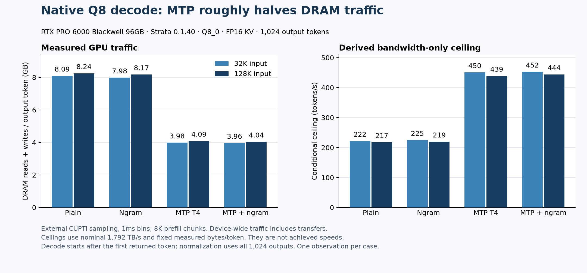

# Native 0.1.40 traffic reference

These are stock Q8_0/FP16 measurements, separate from the combined branch.
32K/128K actual input; plain, MTP T4, ngram and combined;1,024 outputs;
8K prefill chunks. Engine SHA256:
`52443d135cf6076033976bd1f83f52ee689eea1704c10ae01ffad5dd106e763d`.

Nsight Systems supplied kernel/copy timelines and idle/overlap measurements.
Full-model Nsight Compute attempts stalled the host/GPU handshake and were
excluded. Byte counts came from an external CUPTI PM sampler at1ms intervals,
collecting device-wide DRAM reads+writes. A known16GiB-copy calibration agreed
within0.04%; all8sampled requests completed with no counter overflow. Partial
intervals have lower/upper bounds; the first invalid startup sample was rejected.
Decode starts after the first output token and is normalized over all1,024 outputs.

At32K, traffic was about8.09GB/token plain and3.98GB/token MTP. The nominal
1,792.128GB/s bandwidth gives conditional ceilings of roughly221 and450tok/s.
At128K, about8.24/4.09GB/token gives217/439tok/s. These are bandwidth-only
limits at the measured traffic, not achieved speeds or complete CPU/PCIe/compute
limits. They cannot automatically be transferred to the changed combined path.

[Counter summaries and boundary bounds](matrix-summary.json),
[known-copy calibration](copy-calibration-result.json).
Large Nsight/CUPTI traces remain outside this branch.
